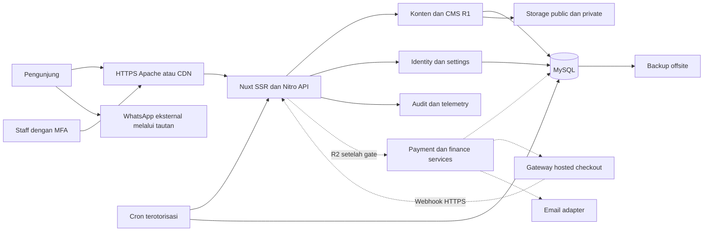
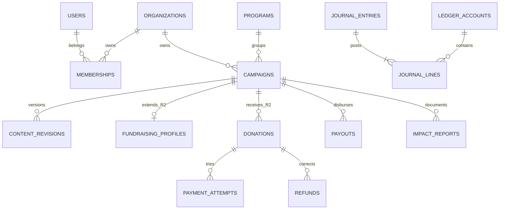
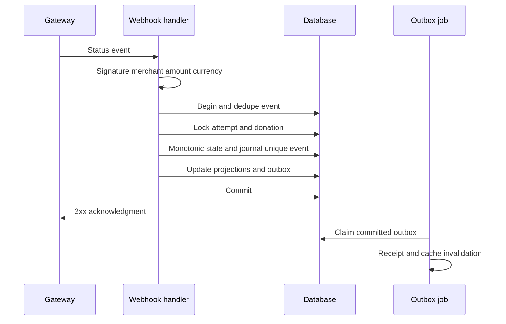

# SDD platform kemanusiaan Shareat

**Versi:** 1.0 · **Tanggal:** 2 Oktober 2026 · **Status:** desain usulan yang belum diimplementasikan. Desain memenuhi baseline [SRS](SRS.md) melalui modular monolith fullstack Nuxt. R1 menjalankan website informasi, CMS, dan WhatsApp; modul keuangan R2 tetap belum aktif sampai gate terpenuhi.

Keputusan utama: satu codebase dan satu database transaksional dengan batas modul yang jelas, SSR untuk konten publik, shadcn-vue untuk UI, media public/private terpisah, serta external adapter untuk WhatsApp, storage, email dan gateway. Tidak ada kebutuhan awal untuk microservices, Kubernetes, Redis, atau worker daemon yang harus berjalan terus pada shared hosting.

## 1. Stack dan kebijakan versi

| Lapisan | Pilihan | Alasan dan pembatasan |
| --- | --- | --- |
| Framework | Nuxt 4 stable + Vue sesuai constraint Nuxt | Fullstack SSR, routing, server API, TypeScript; dokumentasi saat diperiksa menampilkan 4.5.2, patch implementasi dikunci setelah spike |
| Runtime | Node 24 LTS preferensi; Node 22 LTS fallback sementara | Nuxt guide mensyaratkan 22.x+; fallback hanya jika versi dan EOL dipantau. Node yang EOL ditolak |
| Bahasa | TypeScript stable compatible, strict | Shared contracts, typed domain, validator runtime; tipe TS saja tidak memvalidasi input network |
| UI | shadcn-vue, Reka UI, Lucide Vue | Komponen berada dalam repository dan dapat disesuaikan; dependency yang compatible dikunci; tidak memakai shadcn/ui React |
| Styling | Tailwind CSS 4 dengan `@tailwindcss/vite` | Token CSS konsisten; jangan memasang konfigurasi plugin v3/v4 sekaligus |
| Server | Nitro/H3 versi bawaan Nuxt; Node server preset | `.output/server/index.mjs`; kompatibilitas hosting/Passenger harus dibuktikan |
| Data | MySQL 8.4 LTS target, InnoDB, utf8mb4 + Drizzle/mysql2 | SQL transactions, FK, unique constraint dan query yang dapat diaudit; DB provider dapat memerlukan versi berbeda yang masih supported dan lulus spike |
| Validation | Zod stable compatible | Schema request, domain policy, settings dan env; schema server sumber utama |
| Auth | Opaque session database + Node crypto, TOTP library audited | Session revocable dan MFA staff; tidak menulis algoritma TOTP/crypto sendiri, tidak memerlukan provider auth eksternal |
| Fetch/state | Nuxt `useFetch`/`useAsyncData`, server `$fetch`; local state | SSR request lifecycle; Pinia hanya jika kebutuhan state kompleks terbukti, hindari store global SSR untuk data personal |
| SEO | `useSeoMeta`/`useHead`, `@nuxtjs/sitemap`, robots module atau endpoint sendiri | Pilih modul ringan yang kompatibel; OG image static dari pipeline, schema typed helper |
| Media | Static derivatives atau storage adapter kompatibel S3 | Public image resize saat upload/build, tidak memaksa native runtime resize pada host |
| Test | Nuxt test utils + Vitest; Playwright + axe | Domain/integration/end-to-end/aksesibilitas; versi sesuai matriks Nuxt |
| Tooling | npm stable bawaan runtime + lockfile, ESLint Nuxt, formatter | Satu package manager; `npm ci` untuk CI; build di CI Linux yang sesuai produksi |
| Observability | Log JSON + external uptime + error adapter | Vendor bebas konfigurasi, data sensitif dimasking |

Daftar ini bukan klaim bahwa seluruh dependency patch terbaru sudah terpasang atau diuji. Spike menyimpan exact versions, lockfile, hasil build, licensing dan security audit. Beta/RC tidak menjadi baseline produksi. MySQL dan MariaDB tidak dipertukarkan tanpa migration/query/locking test; MariaDB supported dapat menjadi alternatif setelah ADR revisi. Prisma dan Nuxt Content bukan dependency wajib: CMS memakai relational DB agar tidak membuat kebutuhan build/filesystem ekstra di shared hosting.

## 2. Arsitektur sistem dan alur rilis



Backup memindahkan snapshot DB/media ke penyimpanan offsite; restore memakai arah sebaliknya. Public traffic dapat melalui CDN, tetapi private/admin/API keuangan bypass cache. Origin HTTPS tetap berlaku. WA adalah navigasi eksternal dari client, bukan server messaging integration.

### C-01 Public experience

Nuxt server merender data published melalui service public read yang hanya mengembalikan DTO allowlist. List, detail, cerita, dan halaman organisasi tidak mengimpor admin repository langsung. Tidak menyisipkan private field ke payload hydration lalu menyembunyikannya dengan CSS. Server memegang pointer published revision; public UI selalu memakai snapshot yang sudah ditinjau.

### C-02 Content governance

CMS mengelola program, inisiatif, cerita, kebijakan, FAQ dan revisions. Workflow: validasi input → ownership → optimistic version check → simpan draft → submit → checklist review → publish transaction → transactional outbox cache purge/sitemap refresh. Outbox menghindari publish berhasil tetapi perubahan publik tidak pernah diinformasikan ketika proses mati. Proyeksi publik dibatasi TTL pendek selama purge belum berhasil.

### C-03 Identity and access

Server session opaque, permission registry dan organization scope; cookie berisi random 256-bit token, DB hanya hash token. MFA staff memakai TOTP dengan secret encrypted at rest dan recovery code hashed. Password hash scrypt async dari Node; baseline `N=2^15, r=8, p=3` dengan salt unik dan maxmem diuji; scrypt kerja ditolak/diantre saat batas resource tercapai. Jangan mengganti parameter karena host sempit tanpa security review. Session rotation setelah login, MFA dan role change; revoke pada suspend/reset.

CSRF token + origin check untuk cookie-auth mutation, same-site secure cookie, HSTS setelah domain siap, login rate limit DB-based. Login awal memerlukan username/password + MFA; tidak menerbitkan session penuh sebelum MFA selesai. Challenge MFA single use ≤5 menit. Cookie `__Host-shareat_session`, Secure, HttpOnly, SameSite=Lax, Path=/; tidak berbagi Domain. Rate limiter tidak bergantung process memory pada multi-instance.

R1 invitation/reset staff menggunakan token yang diterbitkan server, hash dan expiry pada auth_challenges, disampaikan melalui kanal privat staff yang sudah diverifikasi oleh operator. Recovery request memberi generic acknowledgment dan membuat task operator yang diaudit; tidak menjanjikan email otomatis ketika mail adapter belum disediakan. Bootstrap staff pertama lewat CLI privat, staff kedua diundang setelah verifikasi; token tidak dicetak ke public log atau dikirim dari website lewat WA. MFA recovery membutuhkan dua penanggung jawab dan revoke seluruh session. R2 menambah mail adapter untuk delivery token/receipt yang dibatasi rate dan diaudit.

### C-04 Media and evidence

Upload privat dahulu → inspect MIME/signature/dimensi → quarantine scan → rights review → generate derivatives → tandai publishable → referensikan published content. JPEG/PNG/WebP public; PDF private untuk bukti staff. Object key random dan tidak menerima raw user path. Storage memisahkan namespace/private ACL. Signed access private TTL ≤5 menit atau authenticated streaming; headers `no-store`, `nosniff`, attachment untuk PDF. Pipeline image dilakukan oleh job terbatas atau CI sesuai quota, menghapus EXIF dan menyediakan 400/800/1200/1600 px dengan WebP serta fallback.

### C-05 WhatsApp contact

`ContactLinkService` membaca nomor resmi dan preset message dari settings tervalidasi, menghasilkan URL `wa.me` dengan `URLSearchParams`/encoding aman. Hanya prefix URL tetap; admin tidak memasukkan redirect URL arbitrer. Context berasal nama/slug publik, bukan private free text. Client menggunakan tautan nyata agar tetap berfungsi tanpa JS. Copy number dan native share merupakan progressive enhancement. `noopener noreferrer` pada external new tab; accessible link menjelaskan perpindahan layanan.

### C-06 SEO and publishing

Head dihasilkan server dari published DTO. Canonical menggunakan configured site URL allowlist, bukan raw Host header. Sitemap mengecualikan private/draft/archive, menjaga lastmod sesuai perubahan konten, bukan setiap request. Redirect map menghasilkan satu hop 301. Structured data hanya menyatakan atribut yang tampak dan punya bukti; indexing/ranking atau rich result tidak dijanjikan.

### C-07 Telemetry and jobs

JSON logging dengan requestId, route template, status, duration, actor internal bila perlu dan masking. Analytics opsional; event R1 hanya program_view, initiative_view, outbound_whatsapp, share_copy dan search_empty yang nonpersonal. Jangan menyimpan query bebas jika mengandung data personal. Jobs cron mengambil outbox dengan lease dan retry. Monitoring eksternal mendeteksi endpoint down; log dalam host saja tidak cukup untuk alert saat host mati.

### C-08 Donation and payment

Hanya R2: domain donation intent, payment attempts dan webhook event. Gateway adapter menawarkan `createCheckout`, `getPaymentStatus`, `verifyWebhook`, `requestRefund`, `getRefundStatus`, `listSettlement` dengan normalized types. Availability operasi/channel bergantung vendor; missing capability diwakili typed unsupported result dan SOP. Midtrans merupakan kandidat, belum keputusan vendor. No payment endpoint registered pada R1 build/deployment.

### C-09 Financial ledger

Hanya R2: append-only double entry subledger, rekening dana terikat per campaign, provider receivable, bank clearing, bank cash, biaya operator, refund payable dan suspense. Domain services memegang invariant; repository financial tidak dipanggil modul editorial. Ledger memisahkan penerimaan gateway, clearance bank, transfer penyaluran dan pengakuan penggunaan dana. Reporting rebuildable dan event idempotent. Pembukuan ini subledger operasional; chart of accounts legal dan laporan resmi perlu persetujuan finance/accountant.

### C-10 Reconciliation and disbursement

Hanya R2: import settlement/bank statements, match terhadap payment reference, hold exceptions, dual approval payout/refund, reserve eligible/cash, track transfer confirmation. Baseline transfer payout manual bank dengan evidence dan checker berbeda; tidak menganggap gateway otomatis mengirim uang ke penerima manfaat. Payout baru tidak dapat berjalan ketika reconciliation bermasalah atau statement cutoff tidak cukup mutakhir.

### C-11 Privacy lifecycle

R1: data staff/mitra/media dan kanal WA. R2: data donor dan finance evidence. Access/export/delete melalui verified workflow, retention jobs, suppression list untuk restore, dan pseudonymization identity yang wajib dipertahankan. Export disimpan privat ≤24 jam, signed download ≤5 menit, delete setelah expiry, diaudit. Session staff dan guest tidak tertukar.

### C-12 Runtime and deployment

Satu artifact build Nuxt untuk tiap rilis/environment. Public static di `.output/public`; application runtime `.output/server`. DB/storage tidak berada di artifact release. Cron one-shot dengan lease; tidak perlu daemon terpisah di R1. Health/readiness, backup, secrets, capacity review dan rollback merupakan bagian deployment, dirinci bagian 11.

### C-13 Policy and feature configuration

Config schema mempunyai site identity, WA, jam, media limits, revision, dan release mode. Secrets terpisah environment. R1 menolak payload konten berisi field fundraising, transaksi routes tidak mounted dan komponen UI tidak tampil. R2 harus memiliki server gating yang memeriksa konfigurasi legal/provider/campaign, bukan hanya public feature flag. Public config hanya allowlist informasi nonsecret.

## 3. Struktur source dan batas modul

```text
app/
  assets/css/                 # token dan Tailwind
  components/ui/             # komponen shadcn-vue yang dimiliki proyek
  components/programs/       # komponen produk
  components/initiatives/
  composables/               # UI orchestration, bukan otorisasi
  layouts/                   # public, admin
  middleware/                # navigasi client; server tetap sumber auth
  pages/                     # route Nuxt
server/
  api/v1/                    # HTTP handler tipis
  middleware/                # request ID, header, session context
  modules/
    identity/                # service, repository, policy
    content/
    media/
    contact/
    settings/
    audit/
    privacy/
    donation/                # R2
    payment/                 # R2
    finance/                 # R2
  integrations/              # storage, mail, gateway adapters
  db/schema/                 # per domain, FK explicit
  db/migrations/
  jobs/                      # lease, outbox, maintenance
  releases/r2/api/           # handler keuangan di luar auto-scanned API R1
shared/contracts/            # DTO, enum, schema tanpa secret/server imports
scripts/                     # build/release, cron entry, backup checks
tests/unit/
tests/integration/
tests/e2e/
docs/
```

Handler melakukan schema parse, authenticate/authorize, memanggil service dan memetakan error. Service mengatur aturan/status/transaction. Repository hanya akses SQL; transaksi dipasok service, bukan tersembunyi pada tiap query. Integrasi network tidak dilakukan sambil memegang DB row lock. Dependency lint mencegah import financial repository dari content/UI. Komponen UI boleh memakai shared DTO, tidak schema DB mentah. Handler R2 berada di luar auto-scanned `server/api`; build memasukkannya melalui explicit Nitro handler configuration hanya pada release R2, dan runtime gate tetap diperiksa setiap mutation.

## 4. Model data dan constraint

Semua tabel transactional memakai InnoDB dan UTC `DATETIME(3)`. ID `CHAR(36)` UUIDv4 dari crypto runtime; financial reference provider disimpan terpisah. Slug unique dengan indeks collation yang ditentukan; field nama/copy utf8mb4. Uang `BIGINT` integer IDR dan JSON string decimal agar aman lintas runtime. `version INT` untuk optimistic locking. Soft archive digunakan pada domain publik; ledger tidak hard delete.

### Tabel R1

| Tabel | Field inti | Constraint dan indeks |
| --- | --- | --- |
| users | id, email_normalized, password_hash, status, mfa_secret_cipher, created_at | Unique email untuk staff; suspended/revoked tidak dapat session |
| organizations | id, name, slug, verification_status, verified_by, verified_at, evidence_asset_id | Unique slug; verification checklist privat; verified_by staff berhak |
| memberships | user_id, organization_id, role, status | Unique tuple role/member; indeks org/user; scope grant explicit |
| sessions | token_hash, user_id, expires_at, idle_at, auth_level, revoked_at | Unique token hash, index expiry/user; hashed token tidak di-log |
| auth_challenges | id, user_id, kind, token_hash, expires_at, consumed_at, attempts | Unique hash; atomic single use; purpose-bound |
| programs | id, slug, name, description, sort_order, enabled, published_revision_id, version | Unique slug; FK campaign melarang hard delete yang dipakai; field publik melalui approved snapshot |
| campaigns | id, organization_id, program_id, slug, activity_status, published_revision_id, archived_at, version | Unique slug, FK owner/program; index program/published/status/date |
| content_revisions | id, entity_type, entity_id, revision_number, body_json, status, author_id, reviewer_id, reviewed_at, published_at, checklist_json, content_hash | Unique entity/revision; reviewed identity berbeda; public hanya melalui approved snapshot |
| stories | id, slug, campaign_id nullable, published_revision_id, archived_at, version | Unique slug; index campaign/published date |
| pages | id, slug, kind, published_revision_id, version | Unique slug; kebijakan tanggal efektif ada pada revision |
| assets | id, storage_key, sha256, mime, bytes, width, height, visibility, scan_status, rights_status, consent_ref, owner_org, created_at | Unique key; index owner/visibility; scan dan rights mandatory |
| asset_variants | asset_id, width, format, key, bytes | Unique asset/width/format; publik hanya turunan approved |
| redirects | from_path, to_path, status, changed_by, created_at | Unique from_path; reject loop/internal private target |
| settings | key, value_json, version, changed_by | Schema per key, explicit audit, secret dilarang di value publik |
| audit_logs | id, actor_id nullable, action, resource_type/id, request_id, reason, redacted_diff, created_at | Insert-only application role, index target/time, offsite hash snapshot |
| outbox_jobs | id, type, aggregate_id, dedupe_key, payload_safe, status, available_at, attempts, lease_until, lease_owner, last_error | Unique dedupe key; index status/available; retry safe |
| rate_limit_buckets | key_hash, window_start, count, expires_at | Atomic increment, index expiry; no raw IP/email |
| privacy_requests | id, requester_ref, type, status, verified_at, resolution, due_at | Privat; workflow audit, retensi terpisah |

Tabel revision polimorfik memerlukan validasi entity existence di service karena FK ke beberapa tabel tidak langsung tersedia. FK published_revision_id tetap dibuat; service memverifikasi revision menunjuk entity dan organization yang tepat. Circular FK dilakukan pada migration kedua setelah tabel dibuat; publish transaction mengunci entity dan revision. Alternatif tabel revisions per entity dapat dipilih saat spike jika constraint lebih mudah dibuktikan.

Program adalah taxonomy kecil dengan entity_type program dalam content_revisions; nama/deskripsi/urutan/status yang tampil publik mengikuti review dan published snapshot. Perubahan slug menghasilkan redirect setelah publish. Draft tidak mengubah public program list. Detail campaign menyimpan aktivitas, lokasi aman, tujuan dan schedule dalam published body JSON tervalidasi. Public program list tidak membaca free-form private proof.

### Extension R2

| Tabel | Field inti | Constraint dan indeks |
| --- | --- | --- |
| fundraising_profiles | campaign_id, state, approved_revision_id, approval_ref, legal_scope_ref, permit_expires_at, target_idr, starts_at, ends_at, policy_version | Unique campaign; positive target; approval version binding |
| donations | id, public_id, campaign_id, donor_user_id nullable, email_cipher, alias, anonymous, principal_idr, total_idr, policy_version, successful_attempt_id nullable, created_at | Unique public_id/successful attempt; principal min/max; satu campaign |
| payment_attempts | id, donation_id, provider, merchant_ref, order_ref, transaction_ref, state, amount_idr, expires_at, version, last_verified_at | Unique provider/order_ref, provider/transaction_ref jika ada; amount=immutable donation total |
| webhook_events | id, provider, fingerprint, order_ref, normalized_state, raw_payload_cipher, verification_result, received_at, processed_at, quarantine_reason | Unique provider/fingerprint; index pending/order; signature valid saja dapat posting |
| idempotency_keys | scope, key_hash, request_hash, resource_id, response_safe, expires_at | Unique scope/key; mismatch request409; payment dedupe durable pada order/ledger terpisah |
| donor_access_grants | hash, donation_id, purpose, expires_at, consumed_at, view_session_hash | Hashed bootstrap token, single-use exchange, expiry indexed |
| receipts | id, donation_id, receipt_number, kind, source_ref, snapshot_json, generated_at | Unique number/source_ref, financial fields immutable; corrective receipt baru |
| ledger_accounts | id, code, campaign_id nullable, class, currency | Unique code, only IDR baseline; finance manages account policy |
| journal_entries | id, event_type, event_ref, effective_at, created_at, reason, reversal_of nullable | Unique event_type/event_ref, append only |
| journal_lines | entry_id, sequence, account_id, debit_idr, credit_idr, campaign_id nullable | Unique entry/seq; positive one side, debit=credit validated transaction |
| fund_balances | campaign_id, received_idr, refunded_idr, used_idr, cleared_idr, held_idr, reserved_payout_idr, reserved_refund_idr, version | Unique campaign; materialized projection rebuildable; row locked before reserve |
| cash_balances | account_id, available_idr, reserved_idr, version | Unique bank account; row lock ordered with fund row |
| settlement_batches | id, provider, external_ref, period_start/end, gross_idr, fees_idr, net_idr, state | Unique provider/external_ref; immutable approved import checksum |
| settlement_items | batch_id, external_item_ref, attempt_id, principal_idr, fee_idr, bank_match_ref | Unique batch/item; index attempt/match; fee reconciliation |
| bank_statement_lines | id, bank_account_ref, external_ref, booked_at, amount_idr, direction, checksum | Unique bank/external_ref; raw statement private |
| reconciliation_cases | id, source_type/id, reason, amount_idr, status, owner_id, resolved_at | Tidak dapat dihapus, linked journal correction |
| reservations | id, campaign_id, cash_account_id, type, amount_idr, reference_id, state | Unique type/reference, reserve/release atomic |
| payouts | id, campaign_id, amount_idr, maker_id, checker_id, status, external_ref, payee_ref, evidence_asset_id | Different maker/checker, unique external_ref jika confirmed |
| refunds | id, donation_id, amount_idr, maker_id, checker_id, state, provider_ref, reason | Different identities, cap transaction locked donation; unique provider_ref |
| disputes | id, attempt_id, provider_ref, amount_idr, state, opened_at, resolved_at | Unique provider/ref; hold before resolution |
| impact_reports | id, campaign_id, content_revision_id, period_start/end, metrics_json, evidence_asset_ids | Typed metrics, approval snapshot, no donor-derived counts |

DB users terpisah untuk application dan migrations. Pada shared host yang membatasi grants, append-only dijaga service/permissions dan audit offsite, tetapi risiko admin DB tetap dicatat; R2 membutuhkan kemampuan kontrol yang sesuai. Money CHECK dan FK diuji pada versi actual. Hindari cascade delete terhadap finance; UUID personal reference bisa dipseudonymize sesuai retention policy.

### Hubungan domain



## 5. API dan kontrak integrasi

REST JSON `/api/v1` dipilih untuk public/admin; session via cookies. GET tidak mempunyai side effect bisnis. List mengembalikan `{data, pagination:{page,pageSize,total}, requestId}`; mutation `{data,requestId}`. Error format mengikuti SRS. Semua endpoint private `Cache-Control: no-store`, otorisasi server, CSRF dan rate limit sesuai risiko. Cursor/cutoff pagination digunakan laporan besar R2; pagination page pada public SEO.

### API R1

| Endpoint | Otorisasi | Kontrak utama |
| --- | --- | --- |
| GET `/programs` | Public | Enabled published program DTO |
| GET `/initiatives` | Public | Filter enum allowlist, q≤100, pageSize≤20; hanya published; q tidak masuk raw analytics |
| GET `/initiatives/{slug}` | Public | Published detail safe DTO; absent/private404, permanently withdrawn410 |
| GET `/stories`, `/stories/{slug}`, `/pages/{slug}` | Public | Snapshot content, sanitized HTML/JSON, metadata |
| GET `/contact` | Public | Nomor resmi, jam, URL/preset aman; secret settings tidak terkirim |
| POST `/auth/login`, `/auth/mfa`, `/auth/logout` | Anonymous/challenge/session | Rate-limited, rotate/revoke, generic errors |
| POST `/auth/recovery/request`, `/auth/recovery/complete` | Anonymous/token | Generic receipt, single use; recovery MFA dua staff melalui SOP |
| GET/POST `/admin/initiatives` | Scoped staff | Create/update draft; server derives owner permitted |
| PATCH `/admin/initiatives/{id}` | Scoped editor | `If-Match`/version mandatory; conflict409 |
| POST `/admin/revisions/{id}/submit` | Revision editor | Checklist ready, partner verified, no self review |
| POST `/admin/revisions/{id}/review` | Reviewer | Approve/request changes, reason, checklist, version |
| POST `/admin/revisions/{id}/publish` | Reviewer | Verified revision + entity lock + atomic public pointer + outbox |
| POST `/admin/initiatives/{id}/archive` | Reviewer | Reason, public purge/sitemap outbox, archive history |
| CRUD `/admin/programs`, `/admin/stories`, `/admin/pages` | Appropriate editor/reviewer | Revision process or taxonomy restricted review |
| POST `/admin/media/upload` | Scoped staff | Multipart limited/quarantine; response asset reference, not private public URL |
| GET `/admin/media/{id}/download` | Need-based staff | Audit and signed link/stream, no-store |
| POST `/admin/organizations/{id}/verify` | Authorized admin/reviewer | Evidence/checklist/verification identity; revocation supported |
| POST `/admin/users/invite`, `/admin/users/{id}/suspend`, `/admin/users/{id}/roles` | Authorized admin | Purpose-bound invitation, scope grants dan revocation; audit; tidak dapat bypass dual review |
| GET/PATCH `/admin/settings` | Scoped admin | Whitelist key schema + version + audit, no secrets echo |
| POST `/admin/settings/contact/propose`, `/{proposalId}/approve` | Admin maker/admin reviewer | Perubahan nomor WA published memerlukan dua identitas; draft settings tidak mengubah public link |
| GET `/admin/audit` | Auditor/admin scoped | Redacted searchable log, no mutations |

Ops endpoints terpisah `/health/live`, `/health/ready`, `/internal/jobs/run` dan `/internal/metrics` sesuai host. Live hanya proses hidup, ready mengecek dependency dengan timeout; output publik minimal. Internal endpoint tidak terbuka untuk anonymous: secret scoped disampaikan header, allowlist bila tersedia, signed request/replay protection untuk cron eksternal. CLI cron preferensi; jangan meletakkan secret pada URL.

### API R2 yang tidak terdaftar pada R1

| Endpoint | Otorisasi | Kontrak utama |
| --- | --- | --- |
| POST `/donations` | Guest/session + rate limit | `{campaignId,principalIdr:string,email,alias?,anonymous,policyVersion}` + Idempotency-Key; quote dihitung server |
| POST `/donations/{id}/checkout` | Owner/guest grant | Reuse existing eligible attempt; channel allowlist; unknown lookup; expiry |
| GET `/donations/{id}/status` | Owner/guest view session | Safe status, nominal, expiry; no provider raw/PII |
| GET `/donations/{id}/receipt` | Owner/grant | Private receipt, no-store; PDF baru opsional setelah format diverifikasi |
| POST `/donations/access/request` | Anonymous rate-limited | Generic acknowledgment; kirim bootstrap link jika ada match sah |
| POST `/donations/access/exchange` | Single-use token | Token body exchange into cookie, sanitized URL, no log/referrer |
| POST `/webhooks/payments/{provider}` | Provider signature | Body limit, verification, durable event and ledger transaction/queue policy |
| GET `/me/donations` | Verified donor session | Only own records |
| POST `/admin/fundraising/{id}/transition` | Reviewer/assigned role | Server validates gate, revision, state, schedule, permit |
| POST `/admin/payouts`, `/{id}/approve`, `/{id}/confirm` | Maker/checker | Reserve, dual approval, bank evidence, external reference |
| POST `/admin/refunds`, `/{id}/approve`, `/{id}/submit`, `/{id}/confirm` | Maker/checker | Cap/hold and provider/manual capability |
| POST `/admin/reconciliation/import`, `/{id}/resolve` | Finance | Checksum/dedupe/import dry-run, explicit corrections |
| GET `/admin/finance/reports` | Finance/auditor | As-of cutoff, pagination, private export |
| POST `/privacy/requests` | Verified subject/workflow | Identity verification, rights/retention decision |

Checkout response berisi donation reference, exact total, expiration dan approved provider URL/token bila dibutuhkan, bukan private server key. Redirect return URL hanya dari fixed allowlist. Browser status polling awal 3 detik lalu exponential backoff hingga 30 detik, berhenti saat terminal atau setelah 10 menit; tombol refresh aman tersedia. Reconciliation tetap berjalan ketika user menutup tab. Approval payout mengubah approved event dan reserved state dalam transaksi yang sama; tidak ada window approved yang dapat dieksekusi tanpa reservation.

Untuk link guest dari email, gunakan token pada URL fragment di landing minimal yang tidak memuat tracker dan `Referrer-Policy: no-referrer`; client membaca fragment, segera menghapusnya lewat history, lalu POST exchange. Token single use hash di DB dan purpose donation-specific. Sesi 24 jam tidak memberi akses lintas donation. Jika JS tidak tersedia, arahkan pengguna ke kontak support tanpa mencetak token ke query URL. Account donor claim memerlukan verifikasi email, bukan sekadar mencocokkan input email.

## 6. Transaksi keuangan dan pemulihan R2

### Membuat intent dan checkout

1. Gate R2 + auth/guest policy + validasi campaign active/approval/permit/schedule dibaca server.
2. Idempotency scoped ke session/guest intent dan body hash, quote policy immutable; simpan donation dan planned attempt order reference sebelum network request.
3. Gateway create dilakukan dengan order_ref yang sama; simpan normalized result. Network timeout menyimpan unknown. Lookup sebelum retry; provider tanpa idempotent order/lookup yang cukup tidak memenuhi baseline.
4. Returned checkout URL/channel validated. UI tidak dapat menentukan amount, paid state, biaya, atau campaign approval sendiri.

### Memproses webhook



Verified payment posting idealnya selesai singkat dalam request, target handler <5 detik dan tanpa email network. Untuk event valid yang belum dapat dicocokkan, durable quarantine + 2xx disertai alert dan reconciliation; signature invalid4xx; DB unavailable5xx. Duplicate dengan identical content mendapat2xx tanpa posting baru. Jika postcommit response hilang, provider retry mendapat hasil idempotent. State unknown direkonsiliasi berkala.

Untuk kandidat Midtrans, signature dihitung SHA512 dari concatenated provider strings `order_id + status_code + gross_amount + ServerKey` lalu dibandingkan constant-time; jangan mengubah representasi gross_amount sebelum signature. Setelah verifikasi, parse exact IDR dan cocokkan immutable quote, merchant, order, transaction. Baseline non-card menerima `settlement` dengan fraud/status checks sesuai kontrak channel. `pending`, `authorize`, dan client callback tidak diterjemahkan paid. Dukungan kartu/capture tidak menjadi baseline; bila ditambahkan harus menilai settlement/fraud/PCI dan memperbarui ADR. Sumber: [notifikasi resmi](https://docs.midtrans.com/docs/https-notification-webhooks).

Dedupe event fingerprint mencakup provider/order/transaction/state/status/fraud/amount dan meaningful payload. Unique journal source payment_attempt sukses lebih kuat daripada dedupe payload saja: dua payload berbeda untuk success tidak boleh memposting dua kali. Out-of-order state hanya mengoreksi jika provider source terbaru menunjukkan success; late success masuk exception jika campaign/izin dibekukan. Uang yang nyata diterima selalu dicatat pada ledger termasuk suspense, bukan diabaikan karena state sebelumnya expired.

Donation row lock dan successful_attempt_id yang sudah terisi mencegah dua attempt mengalokasikan principal pada donation yang sama. Late success attempt lain tetap dicatat sebagai provider receivable versus suspense liability dengan external source unik, tidak overwrite successful_attempt_id dan tidak menambah campaign public amount. Reconciliation case mengarahkan finance untuk refund pembayaran ekstra atau keputusan alokasi baru yang sah dengan consent/bukti; receipt/koreksi untuk uang ekstra dibedakan dari receipt donation utama. Uji mencakup attempt expired yang kemudian paid setelah attempt pengganti sudah paid.

### Ledger dan saldo

Contoh Rp100.000 principal, biaya gateway Rp1.000 yang dibayar operator, seluruh nilai contoh **ilustratif**, bukan tarif vendor:

| Peristiwa | Debit | Kredit |
| --- | --- | --- |
| Verified payment | Gateway receivable 100.000 | Restricted campaign liability 100.000 |
| Provider payout 99.000, fee 1.000 | Bank clearing 99.000 + operator fee expense 1.000 | Gateway receivable 100.000 |
| Bank matched | Bank cash 99.000 | Bank clearing 99.000 |
| Operator top-up untuk biaya | Bank cash 1.000 | Operator contributed funds 1.000 |
| Transfer bantuan 80.000 | Disbursement advance asset 80.000 | Bank cash 80.000 |
| Evidence penggunaan disetujui | Restricted campaign liability 80.000 | Disbursement advance asset 80.000 |

Payout transfer confirmed mengurangi kas dan available/reservation; dana bantuan yang belum dipertanggungjawabkan berada sebagai advance, bukan dampak. Fund liability dan advance tersisa tetap terlihat di finance report. Penyajian chart of accounts serta istilah restricted liability adalah desain subledger yang perlu persetujuan accountant sebelum R2. Operator fee tidak mengurangi principal campaign; fee tetap mengurangi kas sampai top-up, sehingga reserve harus mengecek saldo campaign **dan** saldo bank.

Cleared campaign amount baru eligible setelah settlement dan bank matched. Eligible = cleared principal − confirmed refund/chargeback allocated − confirmed payout allocation − active holds − payout reservations − refund reservations, dibatasi kemampuan kas dan penyelesaian advances. Dana pending gateway tidak eligible. Projection uses payout allocation untuk availability, sedangkan ledger expense/restricted release mengikuti evidence approval; keduanya direkonsiliasi dengan mapping advance.

Refund setelah pembayaran: debit restricted liability, kredit refund payable; saat confirmed outgoing: debit refund payable, kredit gateway receivable/bank sesuai actual funding source. Reserve dibuat lebih dulu. Jika dana sudah menjadi advance/terpakai, finance memposting corrective operator/restoration funding dan exception sebelum refund; tidak memaksa akun penerima manfaat atau menolak kewajiban hanya karena campaign available nol. Chargeback menggunakan reversal/source tersendiri dengan external case unique.

Lock order konsisten: donation/attempt → campaign fund row → cash row menurut ID → reservation → journal. Payout/refund tidak perlu mengunci semua campaign; buat transaksi kecil, retry deadlock terbatas dengan jitter, idempotency tetap. Parallel payout tidak dapat mengambil kas yang sama melebihi available. Journal balance diverifikasi sebelum insert dan postcommit reconciliation; DBA/admin write tetap risiko yang dimitigasi privileges serta offsite audit.

### Jobs dan rekonsiliasi

R1: cron setiap 5 menit untuk outbox, expired sessions dan publish/cache tasks; cleanup berat dibatch. R2: pekerjaan notifikasi/unknown/event recovery memerlukan paling lambat 1 menit atau handler+provider email fallback yang dibuktikan; rekonsiliasi pembayaran berkala dan laporan settlement/bank harian. Host hanya dengan cron 5 menit harus dinilai ulang untuk target R2.

Jobs mempunyai dedupe key, lease DB, timeout dan attempts. Retry usulan 1/5/15/60 menit maksimum 8 attempt lalu dead letter + alert. Publish/outbox replay idempotent. Lease claim memakai atomic compare-and-set yang kompatibel DB; SKIP LOCKED tidak diasumsikan tersedia sebelum spike. Receipt email exactly-once ke provider tidak selalu bisa dijamin: gunakan provider idempotency/message key dan tampilkan receipt tetap satu di sistem. Jika email provider tidak mendukung dedupe, kemungkinan email duplikat dicatat sebagai keterbatasan, tanpa financial duplicate.

Reconciliation mengimpor statement privat dan immutable checksum, mencocokkan gross/fee/net/reference/date/cutoff. Ambiguous match tidak auto settle. Bank statement tidak otomatis diparse dari screenshot untuk posting. Semua correction memakai reversal entry dan evidence; operator tidak mengedit nilai lama.

## 7. Desain interface dan design system

| Token | Baseline usulan |
| --- | --- |
| Brand navy | `#132A3A` |
| Primary green | `#166534` dengan teks putih |
| Background | `#F8FAF9` |
| Surface | `#FFFFFF` |
| Body text | `#172B3A` |
| Secondary text | `#475569` |
| Error | `#B91C1C` + label/icon, tidak hanya warna |
| Border | `#CBD5E1`; bukan satu-satunya indikasi focus |
| Focus | `#1D4ED8`, outline 2 px dengan offset 2 px |
| Typography | Sans berlisensi seperti Inter setelah audit, self hosted WOFF2; system fallback |
| Base body | 16–18 px, line-height 1,6; form 16 px minimum |
| Width | Reading max 72ch; page container 1200 px |
| Spacing/radius | 4/8/12/16/24/32/48/64 px; card 12 px, button 8 px |
| Control | Tinggi ≥44 px, label terlihat, error dekat field |

Token adalah usulan baru dari arah warna referensi; contrast semua pasangan/states tetap diuji. Program memakai icon+nama: Eat, Knowledge, Book; warna saja bukan pembeda. Hindari emoji sebagai satu-satunya label aksi. Komponen shadcn diadaptasi konsisten untuk Button, Input, Select, Card, Badge, Tabs, Accordion, Dialog, Alert, Table dan Pagination. Data table admin mempunyai caption/label, status textual, pagination dan loading/error.

Breakpoint berbasis isi: 320–639 satu kolom; 640–1023 dua bila cukup; ≥1024 tiga kartu dan detail dengan sidebar. Breadcrumb wrap, nav mobile berlabel, drawer focus trap dan escape. CTA sticky hanya jika tidak menutup footer/input/focus; reduced motion didukung. Foto hero fixed aspect ratio/width/height, teks tidak ditempel dalam gambar. Tidak ada auto carousel di baseline.

| Template | Isi dan state |
| --- | --- |
| Home | Misi, tiga program, curated initiative, cara kolaborasi, cerita, transparency, WA; empty content jujur |
| Program | Tujuan, bentuk kegiatan, inisiatif terkait, bukti terbaru, FAQ, WA |
| Initiative list | Filter berlabel, apply/reset, pagination, zero result, jaringan gagal dengan retry |
| Initiative detail | Status rencana/kegiatan, lokasi aman, tujuan, penanggung jawab, updates, evidence, WA; fundraising section hanya R2 eligible |
| Transparency | Identitas factual, metode review, status kesiapan, policy dan laporan actual; no fake numbers |
| Story/policy | Reading width, date/author, version/effective date, link related content |
| Admin | MFA, scoped navigation, draft/review badges, concurrent edit notice, publish checklist |
| R2 checkout/status | Quote dan biaya eksplisit; pending/unknown tidak berwarna sukses; expired/retry aman; privacy alias default anonim |

## 8. SEO komprehensif

Kebijakan URL memakai bahasa Indonesia, lowercase kebab-case, HTTPS dan satu host canonical. R1 `/inisiatif/{slug}` dipertahankan sebagai URL canonical pada R2 agar laporan dan inbound links tidak hilang. Bila alias `/kampanye/{slug}` dibuat, alias301 ke canonical, bukan dua halaman identik. Program/konten localized tambahan memerlukan i18n revisi; tidak membuat hreflang yang belum ada.

| Route/template | Render | Index/canonical | Schema |
| --- | --- | --- | --- |
| `/` | SSR public cache | Index, self canonical | Organization + WebSite sesuai identitas actual |
| `/program`, `/program/{slug}` | SSR | Index enabled published, self | CollectionPage/WebPage + BreadcrumbList |
| `/inisiatif`, `?page=n` | SSR pagination | Index pagination valid; canonical self termasuk page, page1 clean | CollectionPage + ItemList dari item aktual |
| `/inisiatif/{slug}` | SSR | Index published, canonical stabil | WebPage + BreadcrumbList; jangan klaim schema crowdfunding rich result |
| `/inisiatif?program=...&lokasi=...` | SSR bounded filter | Noindex, self canonical normalized; curated program page menjadi landing utama | WebPage |
| `/cari?q=...` | SSR dengan query bounded | Noindex, no sitemap; tidak menghasilkan infinite crawl link | Tidak wajib |
| `/cerita`, `/cerita/{slug}` | SSR | Index published | CollectionPage/Article dan BreadcrumbList |
| `/tentang`, `/transparansi`, `/faq`, `/kontak` | SSR | Index jika konten bermanfaat | WebPage; FAQPage jika tepat tanpa janji rich result |
| `/privasi`, `/ketentuan` | SSR | Index factual policy, self canonical | WebPage |
| `/admin/**`, preview | Auth server; no-store | Noindex + access control, no sitemap | Tidak ada |
| `/donasi/**`, status, receipt, `/akun/**` R2 | Protected, no-store | Noindex, no sitemap, no public private data | Tidak ada |
| Unknown/private | Server404 | Tidak index | Tidak ada |
| Permanently withdrawn published | Server410 atau informative retained public page jika layak | Withdrawn410 tidak sitemap; completed report tetap200 index | Sesuai page yang dipertahankan |

Sitemap hanya route approved canonical200, lastmod actual, dibatch dan dipisah jika batas ukuran/URL tercapai. Robots production mengizinkan konten publik. Search/filter noindex tetap crawlable agar directive terbaca; batasi combinatorial links dan parameter allowlist. Jika crawl blocking dipilih kemudian, terlebih dahulu nilai indexing impact; robots tidak menjadi keamanan private page. Staging memakai auth/network restriction + noindex response header; robots disallow saja tidak cukup.

Title unik usulan 35–65 karakter, description sekitar 120–170 tanpa memotong makna; ini panduan editorial, bukan hard SEO rule atau jaminan snippet. H1 satu topik utama, hierarki H2/H3 logis, internal links nyata `<a href>`, alt kontekstual, link text deskriptif. Server serializes JSON-LD safely dan tidak membuka injection `</script>`. Organization tidak memakai NonprofitType/status legal sebelum bukti tersedia. Tidak memakai rating/testimoni markup fiktif atau donation count sebagai aggregate rating.

OG/twitter cards menggunakan approved static image 1200×630 sebagai usulan rasio dan ukuran pipeline, title/description public, cache versions by content hash. `max-image-preview` disesuaikan consent. Share WA memakai canonical tanpa UTM sensitif; UTM kampanye marketing allowable dan tidak mengubah canonical. URL change registry menolak loops, redirect chains dan arbitrary external redirect. Legacy HTML route hanya redirect ke tujuan relevan yang benar; halaman template yang tidak pernah live tidak diasumsikan memiliki SEO history.

Editorial SEO: halaman tiap program memiliki konteks Indonesia, author/penanggung jawab, fakta lokal yang disetujui, kegiatan aktual, pembaruan dan related links. Tidak membuat halaman per kota dengan teks duplikat untuk mengejar traffic. Search Console disiapkan setelah domain aktif; URL inspection, sitemap, coverage dan CWV dimonitor bulanan. Tidak mengklaim ranking, AI citation, rich result atau indexing guaranteed.

## 9. Keamanan, privasi dan trust

Threat focus: pengambilalihan admin, data lintas organisasi, injection konten, file upload berbahaya, kebocoran bukti identitas, perubahan nomor WhatsApp, preview indexing, open redirect, gateway spoof/duplicate pada R2, serta fraud payout. Controls dipetakan pada requirement dan test; tidak menganggap component library otomatis menjamin aksesibilitas atau security.

- Sanitasi rich text allowlist, query parameterized Drizzle, SSR output escaped. Tidak memakai arbitrary `v-html` tanpa sanitizer.
- Session hashing, MFA secret encrypted, per-purpose token single use, no tokens in log. Password/email update meminta re-auth/MFA dan notifikasi pada kanal yang sudah verified.
- CSP default self, script nonce/hash sesuai SSR, storage/image/connect host allowlist. R2 hosted redirect dipreferensikan agar tidak perlu wildcard iframe; vendor requirement ditambah hanya setelah integrasi. CSP report tidak berisi data pribadi.
- Default upload private, AV scan, rights review, attachment PDF, no SVG/HTML upload. Storage secret tidak public runtimeConfig.
- Rate limit usulan login 5 failed/15 menit per account hash dan 30/15 menit per network key; adaptive throttle dan MFA menjaga account tidak bisa DoS hanya dengan lock permanen. Admin recovery case dicatat manual.
- Config nomor WA dianggap change berisiko: reviewer kedua atau approval dua admin untuk perubahan nomor publik; website tidak tiba-tiba mengarahkan ke rekening/nomor baru tanpa audit.
- Private response no-store; CDN cache hanya allowlisted public route. Cache key tidak memasukkan personalized payload; request dengan session tidak dilayani mixed private data. Published DTO sama untuk semua pengunjung.
- R2 request donation rate limit per session/network, abuse report, hold workflow; IP bersifat sinyal sementara/hashing, tidak langsung menjadi blacklist permanen donor.
- Privacy policy menjelaskan WhatsApp eksternal, website analytics, data staff, media rights dan hak subjek. Tim WA memakai akun bisnis resmi yang aksesnya dikendalikan; export/chat backup punya aturan sendiri, tidak diingest ke CMS otomatis.

Dasar legal, dokumen izin dan keterbatasan scope bukan field bebas yang boleh diklaim hanya dengan checkbox admin. Finance/legal menyetujui evidence aktual sebelum R2. R1 transparency memuat status kesiapan yang tepat; tidak mengumumkan badan hukum, izin atau pengawasan yang belum ada.

## 10. Caching, kapasitas dan evolusi

Cache R1 home/program/list maksimal60 detik, detail/story maksimal60 detik; stale content maksimal5 menit hanya untuk approved public content. Withdraw/archive/privacy revocation harus purge origin/CDN segera; jika purge tidak tersedia, route berubah melewati cache dan TTL diperpendek/disable untuk konten tersebut. UI memberi date updated, bukan mengklaim semua data realtime.

Pada R2 status donation/receipt/API mutation uncached; financial public projection boleh30 detik dengan timestamp. CTA aktif tidak hanya bergantung cache page: server intent menilai active/jadwal/gate saat request. Penghapusan informasi berisiko tidak memakai stale-if-error; fail closed atau purge semua layer.

DB connection pool awal5 koneksi per runtime, total instances×pool + cron/migration harus berada di bawah quota provider dengan reserve untuk admin. Index list `(program_id, published_revision_id, activity_status, created_at)`, slug unique, projection/cases/state/date sesuai query. Search title/ringkasan limit dan optional FULLTEXT diuji untuk Bahasa Indonesia; bukan membuat external search cluster sebelum volume membutuhkannya. Hindari N+1 dan membaca body/media full untuk list.

Baseline kapasitas diuji sesuai NFR; benchmark tidak berisi beneficiary/donor nyata. Jika CPU throttling/error/p95 melebihi target, kurangi dynamic render/cache safe dan optimalkan query; jangan membuka private cache demi performance. Upgrade trigger: resource mendekati quota>70% secara berkepanjangan, cron tertunda, DB connection shortage, backup tidak memenuhi RPO, atau availability target gagal. Persentase merupakan threshold usulan yang dievaluasi operator.

Evolusi: pindahkan object storage dari local protected files ke managed bucket lewat adapter; Node runtime ke VPS/managed hosting; tambah worker durable; shared DB session/outbox memungkinkan multi-instance; Redis optional untuk rate/cache setelah dibutuhkan. Financial module dapat dipisah kelak melalui domain interface/outbox tetapi monolith menjadi baseline sampai kebutuhan independen nyata.

## 11. Infrastruktur dan deployment

### Syarat minimum shared hosting R1

| Kemampuan | Minimum yang harus dibuktikan | Alasan |
| --- | --- | --- |
| Runtime | Node supported22+; prefer24; persistent SSR app, auto restart, health visibility | Fullstack tidak dapat dijalankan pada PHP-only |
| Entry/process | Mendukung artifact ESM Nitro Node-server atau integrasi Passenger yang lulus spike | Tombol Node pada panel bukan bukti kompatibilitas |
| Resource | Anggaran desain ≥1 GB RAM proses tersedia dan quota CPU cukup untuk SSR/scrypt; 2 GB preferensi | Actual concurrency/hard limits harus lulus load test; bukan jaminan vendor |
| DB | MySQL supported target8.4, InnoDB, FK/transaction, utf8mb4, minimal quota koneksi yang mencakup app+cron+ops | MariaDB perlu compatibility ADR/test |
| Scheduling | Cron one-shot minimal setiap5 menit, DB lease, CLI runtime atau secure external scheduler | Outbox/cache/session/backup checks |
| Network | HTTPS origin, outbound HTTPS443 ke storage/monitoring, reverse proxy benar, request limits configurable | WA link tidak perlu server call; CMS/operations tetap butuh external access |
| Files/storage | Private directory di luar document root, write rights minimum, quota dan backup; public derivatives terpisah | Evidence tidak boleh tersaji statis publik |
| Secrets | Environment variables privat, tidak served sebagai `.env`, logs limited access | Config runtime/server |
| Deployment | SFTP/SSH atau artifact upload aman, restart controllable, migrations one-shot, release rollback | Build Linux CI, bukan build berat di shared host |
| Recovery | Offsite DB/media backup harian, export/import tersedia dan restore dibuktikan | RPO/RTO R1 |
| Monitoring | Log akses aplikasi, uptime external, resource/cron/quota metrics | Kegagalan dapat diketahui dan direspons |

Disk ditentukan volume media: estimasi count×original+variants+retention dengan ruang≥2× working set dan release/backup headroom; tidak menetapkan “cukup 1 GB” tanpa inventaris dan proyeksi. Local backups saja tidak memenuhi offsite. CDN/domain/storage merupakan optional/pilihan biaya setelah evaluasi.

R2 membutuhkan tambahan inbound webhook HTTPS443 tanpa challenge interaktif WAF, callback tetap saat restart, quota burst, cron/recovery ≤1 menit, target RPO15 menit dengan PITR/log backup, finance data access dan target99,9%. Shared hosting yang tidak menyediakan kontrol tersebut tidak boleh dipaksa menerima transaksi; pindahkan runtime/data ke layanan yang memenuhi gate. Ini keputusan runtime berdasarkan bukti, bukan janji bahwa semua shared hosting cocok.

### Spike kandidat hosting

Uji artifact Nuxt SSR dan `/api` setelah deploy, restart dan idle; ESM startup/port binding/Passenger; env private; session MFA; mysql2 TLS jika remote; transaksi/locking/FK; media public/private dan signed access; cron lease; DB quota/load; public headers/sitemap; 404/410; logs; backup export dan restore. R2 tambah sandbox callback/outbound gateway, idempotency burst, RPO/PITR dan reconciliation recovery.

cPanel Application Manager memerlukan komponen provider seperti Passenger; sumber [cPanel resmi](https://docs.cpanel.net/cpanel/software/application-manager/). Tidak menyediakan bootstrap wrapper ESM-to-CJS generik yang belum diuji. Jika panel mensyaratkan entry berbeda, adapter deployment ditulis setelah environment nyata diketahui dan hasil spike dicatat pada ADR.

### Alternatif bila host gagal

1. Pilih shared hosting Node yang memenuhi syarat dan hasil spike.
2. Tempatkan aplikasi fullstack Nuxt pada VPS/managed Node, gunakan domain yang sama melalui DNS; shared hosting dapat tetap untuk email/static jika diperlukan.
3. Jika biaya mengharuskan PHP-only, fullstack Nuxt di host itu tidak terpenuhi. Static R1 + external CMS/API adalah arsitektur berbeda yang memerlukan persetujuan lingkup/revisi dokumen. Static generate tidak memberi CMS/auth/payment backend secara otomatis.

### Environment dan release

Environment development/staging/production terpisah database, storage, nomor WA testing dan domain. Staging memakai sandbox data dan auth/noindex; tidak menyimpan donor/bukti asli. `.env.example` kelak hanya key dan nonsecret sample. Runtime secret melalui environment, konfigurasi Nuxt mengikuti mapping `NUXT_` untuk runtimeConfig; baca raw process env hanya di server adapter tervalidasi. Jangan mengasumsikan `.env` dibaca artifact production.

| Config | Kelas | Nilai yang harus tersedia |
| --- | --- | --- |
| Site URL, display name, WA, hours | Public allowlist | Approved actual data, default belum siap memblokir publish kontak |
| Release mode | Server | `information` R1; `fundraising` R2 setelah gate |
| DB connection | Secret server | Provider supported DB, password, TLS policy |
| Session/MFA encryption keys | Secret server | Key rotation/version, tidak sama dengan cron/payment |
| Storage endpoint/access/keys | Secret server | ACL private/public separate |
| Cron signing/key | Secret server | Scoped job endpoint or CLI, rotation |
| Gateway server key/provider/merchant | Secret R2 | Sandbox/production separated |
| Email API credentials | Secret jika digunakan | Verified sender/SPF/DKIM/DMARC, delivery logs redacted |

Pipeline: lint → typecheck → domain/integration/E2E rilis terkait → security/dependency check → production build → artifact integrity → backup/preflight → compatible migration → deploy/switch runtime → health/SEO/auth smoke → monitoring window. Failure: rollback previous artifact; DB schema rollback hanya jika aman, utamakan expand/contract dan forward fix. Destructive migration tidak dilakukan otomatis pada switch release.

Build flags rilis dan server settings harus konsisten; server menolak fundraising mutation jika gate disabled sekalipun artifact memuat future code. Untuk R1 API payment routes di-exclude/conditional registration sehingga direct request404. Migration R2 dilakukan terpisah ketika development R2; tidak menambah seluruh tabel finance pada DB R1 tanpa kebutuhan.

### Backup, restore dan runbook

R1 DB harian consistent snapshot + private/public media manifest + revision/audit export; terenkripsi ke akun storage terpisah, checksum dan backup age alert. Restore triwulanan serta sebelum perubahan besar mengukur RPO/RTO actual. Key encryption tidak disimpan hanya di backup yang membutuhkan key tersebut. Setelah restore, apply privacy suppression list dan expired/revoked token rules sebelum situs dibuka.

R2 transaction logs/PITR, offsite dan restore rehearsal dengan payment replay. Bukti finance/media R2 memakai object versioning/replication serta manifest/audit offsite paling lambat15 menit; bukti belum durable tidak dapat dipakai mengonfirmasi payout. Target recovery mencakup DB, referensi eksternal dan bukti, bukan DB saja. Freeze checkout/payout saat recovery; reconcile periode setelah backup dengan gateway/bank; replay normalized event idempotent; rebuild projection; verify journal balance dan reservation; checker menyetujui reopen. Restore tidak mengirim ulang email/payout sebelum source refs dibandingkan. Pending/unknown selama outage tidak menjadi failed secara otomatis.

Runbook wajib: website down, DB quota/connection, media blocked/quota, cache purge failure, admin takeover, WA nomor salah, content/privacy incident, backup stale, dan R2 webhook failure/unknown payment/settlement difference/payout dispute. Masing-masing mencakup detection, owner, containment, recovery, communication factual, evidence dan postincident correction.

## 12. Pengujian dan urutan implementasi

Unit untuk domain validation, role policy, revision state, WA encoding, canonical dan money invariant R2. Integration dengan versi DB production untuk locking, idempotency, published DTO privacy, atomic outbox dan migrations. E2E R1 untuk mobile public navigation, keyboard/MFA CMS, mitra scope, approve/publish, WA/fallback, noindex dan404; R2 menambah sandbox checkout/webhook/refund/reconciliation. Access control dan finance memiliki negative tests; load dan restore membuktikan target host.

R1 implementasi bertahap: spike stack/host → auth/schema/media → design system/public CMS → editorial/review/WA → SEO/privacy/jobs → testing/restore → release. R2: legal/policy ready → extension schema/ledger → adapter sandbox → donation/status/access → reconcile/refund/payout → tests crash/replay → finance pilot → activation. Semua TC pada [matriks](TRACEABILITY.md) merupakan rencana; laporan dokumentasi tidak mencentang hasil aplikasi sebagai lulus.
